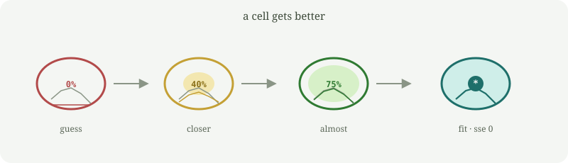

# mejorante

A small Rust program that rewrites a piece of its own source, checks whether the change is better, and can write a child project that inherits the improvement.

It is not a language model and it does not spread by itself. You point it at a folder; it only writes there.

The part that evolves is a tiny math expression called the **brain**. The program tries to match this function:

```
f(x) = x² + 3x + 5
```

on `x = -5 … 5`. Score is the sum of squared errors (**sse**). Lower is better. Zero is a perfect fit.

```
parent    brain  0                              sse  4323
  │ evolve
  ▼
child     brain  (+ (+ (* 3 x) (* x x)) 5)      sse  0
```

That child expression is `x² + 3x + 5`. Search may find a longer equivalent first; algebraic identities then shrink it.



Watch it happen in the terminal. One cell, filling up as the error drops. On the right: the target curve vs the brain, and how the error falls over time. `dish` defaults to seed 7, which reaches a perfect fit in a few steps.

```bash
cargo run -- dish
```

## Run it

You need [Rust](https://rustup.rs/).

```bash
cargo build --release
./target/release/mejorante identity
./target/release/mejorante evolve --steps 120 --spawn ./hijo --build
./hijo/target/debug/mejorante identity
```

`identity` prints the current generation, brain, and score.  
`evolve --spawn ./hijo --build` searches for a better brain, writes a child crate into `./hijo`, and compiles it.

## Commands

```
mejorante identity              generation, lineage, brain, score
mejorante eval [x]              brain vs the target function
mejorante evolve                search for a better brain
                 --steps N      search steps (default 120)
                 --lambda L     mutants per step (default 30)
                 --seed S       reproducible RNG
                 --spawn <dir>  write a child with the winner
                 --build        compile that child
                 --force        overwrite a previous child
                 --write        update src/main.rs in this project
mejorante dish                  animate a cell fitting the curve
                 --steps N      search steps (default 120)
                 --lambda L     mutants per step (default 30)
                 --seed S       default 7 (the reliable demo)
                 --delay MS     ms per frame (default 80)
mejorante spawn <dir>           copy the current genome (no search)
mejorante genome                print the embedded sources
```

`--spawn` leaves this program alone and writes a selected child.  
`--write` edits this project's `src/main.rs`; rebuild so the binary picks up the new brain.

## How it works

The brain lives in a constant in `src/main.rs` as prefix notation: `x`, small integers, `+`, `-`, `*`. Example: `(+ (* x x) 1)` means `x² + 1`.

1. Parse the current brain into a tree.
2. Each step makes several random mutants (swap a leaf or operator, grow, or shrink).
3. Keep the mutant with the lowest `sse + 0.01 × size`.
4. With `--spawn`, write a full Cargo project whose source contains that brain. After you compile the child, the improvement is baked in.

The scoring function never changes. Once the brain matches the target, algebraic identities shrink the expression (`(+ x x)` becomes `(* 2 x)`, zeros and ones drop) without changing the fit.

## Safety

- One child per run. No background loops, no network.
- It will not write over your home directory, `/`, `/usr`, `/etc`, or the directory you are standing in.
- `--force` only deletes a folder that already looks like a `mejorante` project.

## Related

[replicante](https://github.com/PascualMacana/replicante) is a sibling that copies itself but does not improve.
